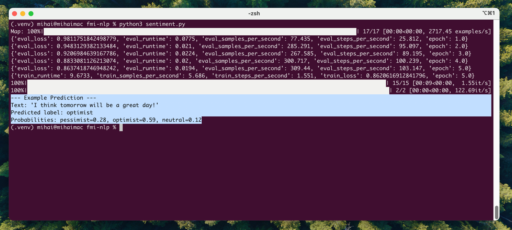

# Sentiment Analysis: Optimism vs Pessimism Classifier

Proiect pentru cursul **„Introducere în Procesarea Limbajului Natural”** – Facultatea de Matematică și Informatică, Universitatea din București.

---

## 📘 Descriere
Model NLP care clasifică propoziții în trei categorii de sentiment:
- `optimist`
- `pessimist`
- `neutral`

Folosim modelul `BERT` pre-antrenat (`bert-base-uncased`) și biblioteca `transformers` de la Hugging Face pentru fine-tuning.

---

## 🧱 Structura codului
- `sentiment.py` – scriptul principal cu antrenare + inferență
- `requirements.txt` – lista dependențelor Python
- `run.sh` – script pentru rulare automată

---

## ▶️ Rulare automată

```bash
chmod +x run.sh
./run.sh
```



---

## 🛠️ Setup manual (dacă nu folosești `run.sh`)

```bash
python3 -m venv .venv
source .venv/bin/activate
pip install -r requirements.txt
python3 sentiment.py
```

---

## 🧪 Testare proprie

Editează la finalul fișierului `sentiment.py`:

```python
example_text = "I think tomorrow will be a great day!"
```

Poți pune orice propoziție dorești pentru test.

---

## 📦 requirements.txt

```
transformers~=4.50.3
datasets~=3.5.0
scikit-learn~=1.6.1
pandas~=2.2.3
matplotlib~=3.9.4
seaborn~=0.13.2
numpy~=2.0.2
torch~=2.6.0
accelerate>=0.26.0
```

---

## 👥 Autori
- Mihai Tuhari
- Lorena Potlog
- Alexandru Enache

